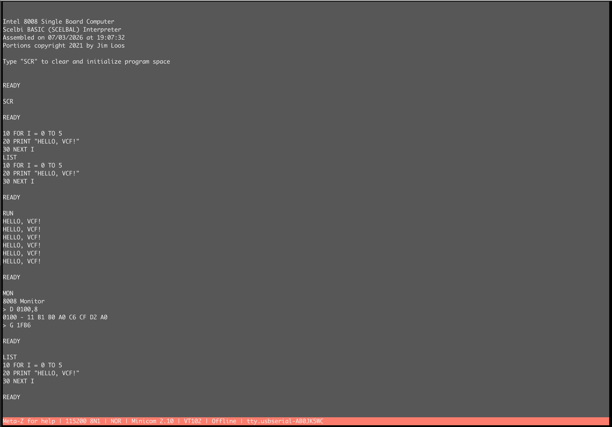

# b8008 - Block-Based Intel 8008 in VHDL

A modular VHDL implementation of the Intel 8008 microprocessor (1972) following the original block diagram architecture. Cycle-exact, validated on FPGA hardware, runs period software.

[](https://github.com/robertrico/intel-8008-vhdl/actions/workflows/verification.yml)
[]()
[](LICENSE.txt)

## It boots into BASIC



The board powers on into Jim Loos's SCELBAL (SCELBI BASIC, 1976) from ROM. Shown above: a FOR/NEXT loop, `MON` dropping to the machine monitor (dumping the tokenized BASIC program from RAM), and `G 1FB6` warm-returning to BASIC with the program intact.

## What runs on it

All period software below runs on the FPGA, loaded over serial through the monitor or resident in ROM. Each port's changes are documented in the commit history.

| Program | Year | Notes |
|---------|------|-------|
| SCELBAL (SCELBI BASIC) | 1976 | ROM-resident with `MON` escape to monitor, or RAM-loaded |
| Mandelbrot renderer | — | Renders correctly at full resolution |
| Pi digit generator | — | 49/50 digits (the 50th is the original's guard-byte truncation) |
| HEXPAWN | 1973 | Self-modifying learning game |
| SCELBI FP Calculator | 1974 | 23-bit floating point; `12.2 X 2.2 = 26.84` |
| STARS | Byte 5/1976 | Interactive game via RST-vector I/O |

## Project Status

**Silicon-validated on a Lattice ECP5-5G Versa.** 37/37 regression tests, 46/46 hardware ISA self-tests on the board, cycle-exact T-states verified against the datasheet for all 27 timing classes.

| Component | Status |
|-----------|--------|
| Instruction set (48 opcodes, 28 categories) | ✅ Silicon validated |
| PC-in-stack architecture (PC = stack slot[SP], per Intel block diagram) | ✅ Silicon validated |
| Cycle-exact T-states (5/8/11 per instruction, `docs/isa.json`) | ✅ 27/27 classes |
| Flags: INR/DCR preserve carry; rotates write carry only | ✅ Per 8008 spec |
| Interrupts at instruction boundaries only (Figure 2, User's Manual) | ✅ Silicon validated |
| Real WAIT state (READY parks CPU between T2/T3) | ✅ Front-panel switch |
| Runtime interrupts (front-panel switch, selectable RST vector) | ✅ Silicon validated |
| Interactive monitor (D/W/L/G/H, Intel HEX loading) | ✅ Silicon validated |
| SCELBAL — RAM-resident and ROM-resident (boot-to-BASIC) | ✅ Silicon validated |

## Verification

Module contracts are machine-checked in CI on every push (`verification` badge above):

- **SBY property proofs** — module contracts as PSL/VHDL assertions; k-induction where possible, bounded model checking otherwise. Cover checks confirm the properties are reachable.
- **Synthesis round-trip equivalence** — each module is synthesized with Yosys, written back to VHDL (`write_vhdl`), and checked equivalent to the original RTL: EQY for combinational modules, SBY miters for sequential ones (write_vhdl splits vector flops, which breaks EQY's partition matching).
- **Exhaustive sweeps against independent models** — instruction decoder: all 256 opcodes against a Python model written from the datasheet (found issue #4, since fixed). ALU: all 1,049,600 cases (arithmetic + logical) against a reference model.
- **Mutation-tested checkers** — each property suite and sweep was validated by planting a bug in the RTL, confirming the checker fails, then reverting.
- **cocotb testbenches** — Python random-walk tests that run against both the RTL and the round-tripped netlist (`DUT_VARIANT=rtl|netlist`).

Scorecard:

| Module | SBY properties | Round-trip equivalence | cocotb |
|--------|---------------|------------------------|--------|
| stack_pointer | ✅ k-induction | ✅ miter (k-induction) | ✅ rtl + netlist |
| state_timing_generator | ✅ k-induction (21 arcs + status table) | — | — |
| machine_cycle_control | ✅ bmc | — | — |
| condition_flags | ✅ k-induction | — | — |
| register_file | ✅ k-induction | ✅ miter (k-induction) | — |
| stack_memory (PC-in-stack) | ✅ k-induction | ✅ miter (bmc) | — |
| memory_io_control | — | — | ✅ 21 instruction scenarios, rtl + netlist |
| instruction_register | ✅ k-induction | ✅ miter (k-induction) | — |
| temp_registers | ✅ k-induction | ✅ miter (k-induction) | — |
| interrupt_ready_ff | ✅ k-induction | ✅ miter (k-induction) | — |
| ahl_pointer | ✅ bmc | ✅ EQY | — |
| alu (+ carry_lookahead) | — | ✅ miter (bmc) | exhaustive sweep in sim |
| carry_lookahead | — | ✅ EQY | — |
| instruction_decoder | — | ✅ EQY | ✅ 256-opcode sweep, rtl + netlist |
| scratchpad_decoder, io_buffer, mem_mux_refresh | — | ✅ EQY | — |
| MCC+STG composition cluster | ✅ mutex + status bijection (bmc-120) | — | — |
| full core (b8008) | — | ✅ regression suite with netlist core swap (CI, both cores) | ✅ external bus-protocol monitor + differential fuzzer |

Every b8008 module has machine-checked verification. CI runs per push: the full 37-test assembly regression suite on both the RTL and round-trip-netlist cores, all unit testbenches, 11 SBY property suites (including the composition cluster), 7 SBY miters, 6 EQY equivalence checks, 7 cocotb runs (including the whole-system bus-protocol monitor), and a differential fuzzer — seeded random legal 8008 programs run on both cores under three oracles at once (bus-protocol monitor, per-instruction datasheet timing, and an rtl-vs-netlist trace diff). Findings are tracked as repo issues.

## Architecture

b8008 follows the Intel 8008 block diagram with explicit, simple modules:

```
┌─────────────────────────────────────────┐
│         Timing & Control Unit           │
│  (State Machine: T1→T2→T3→T4→T5)        │
│  Cycle-exact: cycles end where the      │
│  datasheet says (T3 for fetches, etc.)  │
└──────────┬──────────────────────────────┘
           │ control signals
           ↓
┌──────────────────┐  ┌─────────────────┐
│  Address Stack   │  │ Instruction Reg │
│  (8 x 14-bit)    │  │ & Decoder       │
│  slot[SP] = PC   │  └─────────────────┘
│  post-increment  │
└──────────────────┘  ┌─────────────────┐
┌──────────────────┐  │  Register File  │
│  Stack Pointer   │  │  (A,B,C,D,E,H,L)│
│  (3-bit, wraps)  │  └─────────────────┘
└──────────────────┘  ┌─────────────────┐
                      │      ALU        │
                      │  (8 ops + rot)  │
                      ├─────────────────┤
                      │ Carry Look-Ahead│
                      │ (the real adder)│
                      └─────────────────┘
```

Like the real chip, there is **no separate program counter** — the PC is whichever of the eight 14-bit address-stack registers SP points at. CALL is just SP moving on (the old slot keeps the return address); RET is SP moving back. Seven nested returns; the eighth CALL wraps onto the oldest.

**Design Principles:**
- Each module is simple (~50-100 lines)
- Modules are "dumb" - no instruction knowledge
- Control unit is the only smart component
- Explicit control signals, no boolean soup

## FPGA Personalities

Two complete system builds share the CPU core via memory-map generics:

| Project | Boot behavior | Memory map |
|---------|--------------|------------|
| `projects/b8008_monitor` | Boots to the machine monitor; load programs over serial (`L`), run them (`G`) | ROM 4KB @ 0x0000, RAM 12KB @ 0x1000 |
| `projects/b8008_basic` | **Boots straight into BASIC** (the tiny OS); `MON` drops to the monitor, `G 1FB6` warm-returns | RAM 4KB @ 0x0000, ROM 12KB @ 0x1000 (monitor + SCELBAL) |

```bash
cd projects/b8008_basic
make build        # synthesize + place & route + bitstream
make prog-flash   # persist to SPI flash
```

Serial: 115200 8N1, local echo off, DEL (not BS) for rubout.

## Building and Testing

### Prerequisites

- [OSS CAD Suite](https://github.com/YosysHQ/oss-cad-suite-build) (includes GHDL, Yosys, nextpnr)
- [AS Assembler](http://john.ccac.rwth-aachen.de:8000/as/) for 8008 assembly
- macOS (tested on Sequoia 15.6.1)

### Make Targets

```bash
# Run main system test
make test-b8008-top

# Run with specific program
make test-b8008-top PROG=search_as

# Test individual modules
make test-stack-memory    # Address stack (PC-in-stack)
make test-alu             # ALU
make test-alu-exhaustive  # All 1,049,600 ALU cases vs reference model
make test-instr-decoder   # Instruction decoder

# See everything
make help
make show-programs
```

### Verification Scripts

```bash
# Run ALL verification tests (regression suite, 37/37)
./test_programs/verification_scripts/run_all_tests.sh

# Individual checks
./test_programs/verification_scripts/check_alu_test.sh
./test_programs/verification_scripts/check_cycle_count_test.sh   # cycle-exact T-states
./test_programs/verification_scripts/check_interrupt_test.sh
```

The board also carries a **46-test hardware ISA self-test ROM** (`make` targets under `projects/b8008_monitor`) that runs on silicon and reports over serial.

## Writing Test Programs

This project uses AS Assembler with **8080 syntax**:

```assembly
        cpu     8008new
        org     0000h

        MVI     A,42h       ; Load immediate
        MVI     B,24h
        ADD     B           ; A = A + B
        HLT

        end
```

Assemble and test:
```bash
make assemble PROG=my_test.asm
make test-b8008-top PROG=my_test
```

Period software ports live in `test_programs/samples/` — see `docs/RAM_PROGRAMS.md` for the load-and-go porting recipe.

## Intel 8008 Specifications

- **Year**: 1972 (world's first 8-bit microprocessor)
- **Clock**: 500-800 kHz
- **Registers**: 7 × 8-bit (A, B, C, D, E, H, L)
- **Stack**: 8-level internal, 14-bit addresses — the PC is one of them
- **Address Space**: 16 KB (14-bit)
- **Instructions**: 48 opcodes in 28 categories, 5/8/11 T-states each

## Documentation

- [TODO.md](TODO.md) - Verification roadmap (complete) and history
- [docs/isa.json](docs/isa.json) - Per-instruction T-state mapping (source of truth for cycle exactness)
- [docs/RAM_PROGRAMS.md](docs/RAM_PROGRAMS.md) - Porting recipe for period software
- [docs/INTERRUPTS.md](docs/INTERRUPTS.md) - Interrupt system details
- [docs/instruction_coverage.md](docs/instruction_coverage.md) - Opcode test coverage matrix
- [docs/LEGACY.md](docs/LEGACY.md) - Previous implementations (s8008, v8008)
- [projects/b8008_basic/MEMORY_MAP.md](projects/b8008_basic/MEMORY_MAP.md) - The tiny OS memory map

## Legacy Note

This is the third implementation iteration:
- **b8008** - Current, block-based design
- **v8008** - Abandoned (too complex)
- **s8008** - Worked on FPGA but had timing issues

See [docs/LEGACY.md](docs/LEGACY.md) for details.

## Resources

- [Intel 8008 Datasheet (1972)](docs/8008_1972.pdf)
- [Intel 8008 User Manual](docs/8008UM.pdf)
- [SIM8-01 Reference Design](docs/SIM8_01_Schematic.pdf)
- [Mike Willegal's SCELBI archive](https://www.willegal.net/scelbi/apps8008.html) - source of the period software
- [Jim Loos's 8008-SBC](https://github.com/jim11662418/8008-SBC) - the SCELBAL build this project runs

## License

MIT - See [LICENSE.txt](LICENSE.txt)

## Attribution

- **Robert Rico** (2025-2026) - VHDL implementation
- **Jim Loos** - SCELBAL build for the 8008-SBC (portions copyright 2021)
- **SCELBI Computer Consulting / Mark Arnold & Nat Wadsworth** - SCELBAL (1976)
- **Mike Willegal** - SCELBI software archive
- **Michael Kohn** - Verilog i8008, consulted as reference material
- **Intel Corporation** - Original 8008 design

See [ATTRIBUTION.md](ATTRIBUTION.md) for full credits.
